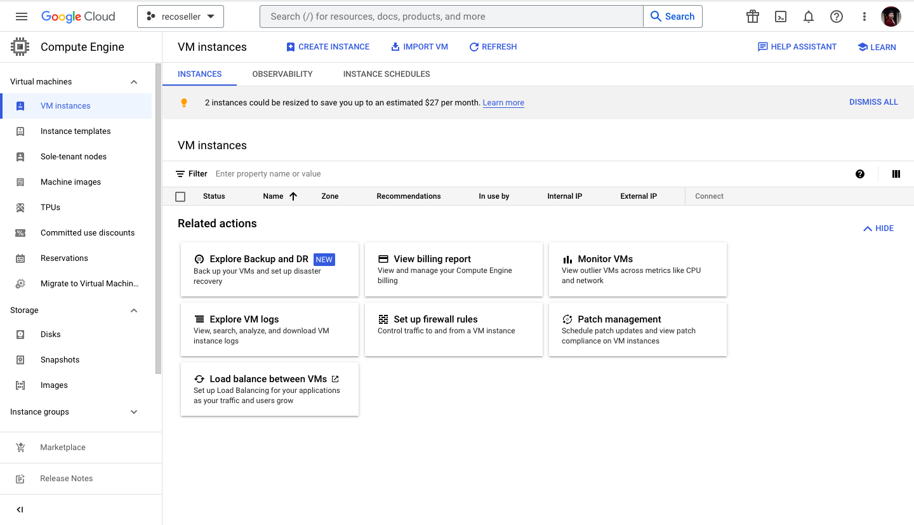
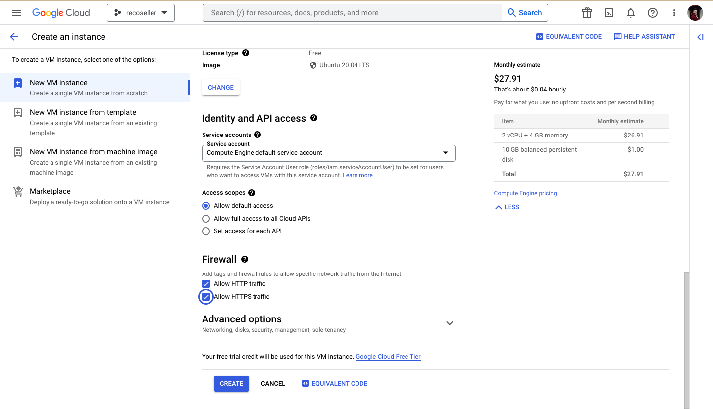
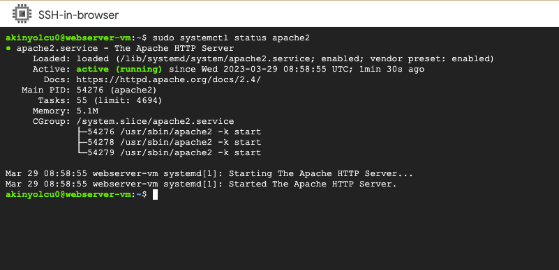
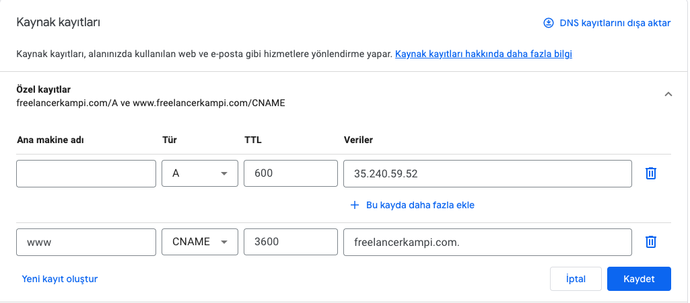
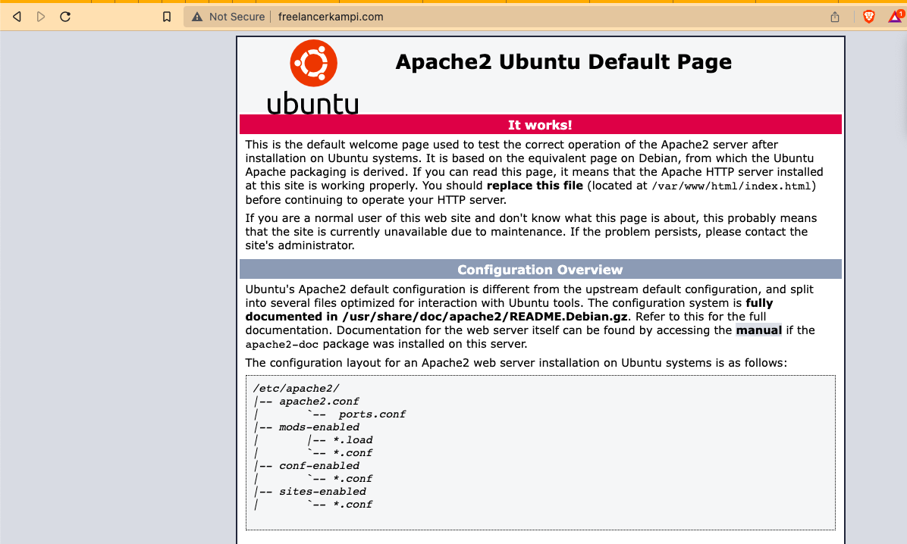
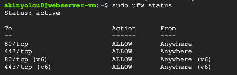
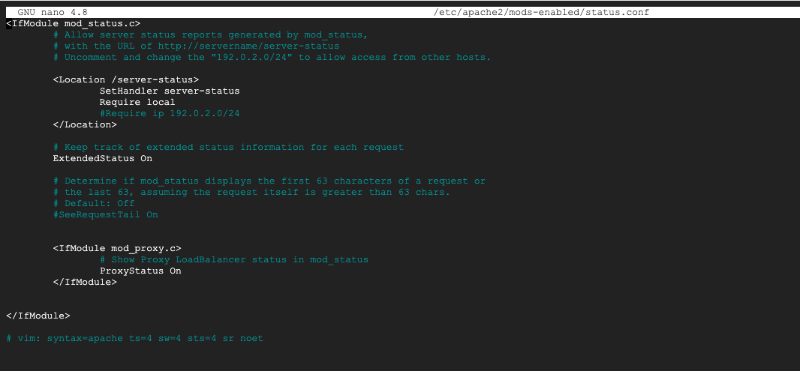
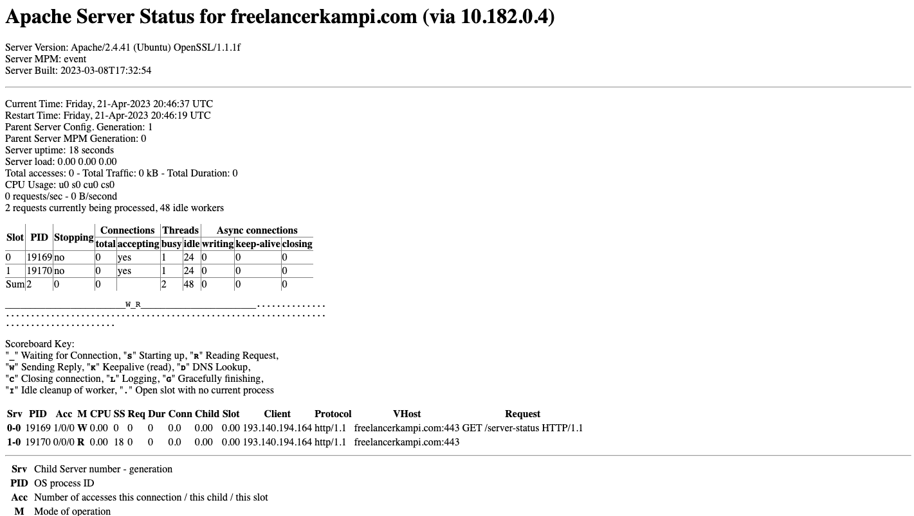
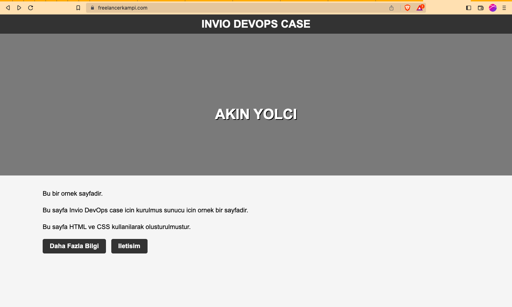

<h1 align="center">WebServer With Google Cloud Platform</h1>
<h3 align="center">Google Cloud Platform üzerinde Linux tabanlı Web Server kurmak. | Case | Invio </h3> 


<!-- TABLE OF CONTENTS -->
<h2 id="table-of-contents"> :book: İçindekiler</h2>

<details open="open">
  <summary>İçindekiler</summary>
  <ol>
    <li><a href="#case-hakkinda"> ➤ Case Hakkında </a></li>
    <li><a href="#gerekenler"> ➤ Gerekenler </a></li>
    <li>
      <a href="#yol-haritasi"> ➤ Yol Haritası</a>
      <ul>
        <li><a href="#vm-kurma">GCP'de Sanal Makine Kurulumu</a></li>
        <li><a href="#apache">Web Sunucusu Kurulumu</a></li>
        <li><a href="#domain">Domain Bağlama</a></li>
        <li><a href="#ssl-tls">SSL/TLS Şifreleme Kurulumu</a></li>
        <li><a href="#guvenlik">Güvenlik Duvarı Kuralları</a></li>
        <li><a href="#backup">Yedekleme ve Geri Yükleme Mekanizması</a></li>
        <li><a href="#kimlik-dogrulama">Kimlik Doğrulama</a></li>
        <li><a href="#performans-izleme">Performans ve Sağlık İzleme</a></li>
        <li><a href="#docker">Projeyi Dockerize Etme</a></li>
      </ul>
    
  </ol>
</details>


<!-- CASE HAKKINDA -->
<h2 id="case-hakkinda"> :pencil: Case Hakkında</h2>

<h4> Linux tabanlı bir Web Sunucusu kurun</h4>
<p align="justify"> 
Bir web sitesini barındırmak için Linux tabanlı bir web sunucusu kurmakla görevlendirildiniz. Sunucu, web sayfalarına hizmet verecek şekilde
yapılandırılmalı ve ayrıca sunucuyu ve web sitesini korumak için güvenlik önlemleri uygulamalısınız. İşte meydan okuma için gereksinimler:
</p>
<p>
Bir Linux-ba sed sistemine bir web sunucusu kurun ve yapılandırın (tercih ettiğiniz herhangi bir dağıtımı kullanabilirsiniz).
Web sunucusunu temel bir web sayfası sunacak şekilde yapılandırın.
</p>
<p>
SSL/TLS şifreleme, güvenlik duvarı kuralları ve kimlik doğrulama gibi güvenlik önlemlerini uygulayın.
Veri bütünlüğünü sağlamak için bir yedekleme ve geri yükleme mekanizması kurun.
</p>
<h4>
Sunucunun performansını ve sağlığını izlemek için günlük kaydı ve izleme uygulayın.
Bonus puanlar şunlar için verilecektir:
</h4>
<p>
Ansible, Puppet veya Chef gibi bir yapılandırma yönetim aracı kullanarak web sunucusunun dağıtımını ve yapılandırmasını otomatikleştirme.
</p>
<p>
Docker kullanarak web sunucusunu kapsayıcı hale getirmek.
</p>
<p>
Trafiği birden fazla web sunucusu örneğine dağıtmak için bir yük dengeleyici uygulamak.
</p>


<!-- Gerekenler -->
<h2 id="gerekenler"> :fork_and_knife: Gerekenler</h2>


Projede kullanılan dağıtımlar, eklentiler vb.:
* Ubuntu 20.04 LTS
* Apache2
* Certbot-apache
* UFW
* rsync
* Docker


<!-- Yol Haritası -->
<h2 id="yol-haritasi"> :dart: Yol Haritası</h2>

<h3 id="vm-kurma"> GCP'de Sanal Makine Kurulumu :<h3/>
<br>
<p>Google Cloud ortamında Linux işletim sistemli bir VM kurup Case'i buradan yürütme kararı aldım. Bu şekilde daha hızlı monitor edebilir veya her yerden Google hesabımla erişebilirim. </p>
<p align="center">
  
</p>  
<p>
Region ve Zone seçtikten sonra işletim sistemi olarak Linux'un Ubuntu dağıtımını seçiyorum. Firewall ayarından http ve https isteklerini aktif ediyorum.
Ve Sanal makineyi kuruyorum. Makineyi kurduktan sonra direkt olarak GCP üzerinden SSH bağlantısı kuruyorum. Sonrasında bu makineye web server kuracağım.
</p>
<p align="center">
  
</p> 
  

  
  
<h3 id="apache"> Web Sunucusu Kurulumu :<h3/>  
  
  <p> Web sunucusu olarak Apache tercih etmemin sebebi daha önce de php tabanlı sitelere baktığım için aşina olmam. Nginx ile de kurulabilirdi. Ben bu case için Apache2 Web sunucusunu tercih ettim. Apache kurmak için: </p>
  
 ```sh
    sudo apt-get install apache2
  
 ```
  
  <p>Kurulumdan sonra çalıştıralım</p>
  
 ```sh
    sudo systemctl start apache2
  
 ```
  <p>Apache'nin otomatik olarak başlatılmasını sağlayalım</p>
  
 ```sh
    sudo systemctl enable apache2
  
 ```
  
  <p>Apache'nin durumunu kontrol edelim.</p>
  
 ```sh
    sudo systemctl status apache2
  
 ```
  
<p align="center">
  
</p> 
  
  


<h3 id="domain"> Domain bağlama :<h3/> 
  
  <p>statik web sitesini görmemiz ve SSL/TLS ayarları için bir domain bağlamak istedim. Google Domains'te hazırda bulunan bir alanadının DNS ayarlarında bir A kaydı açarak sunucunun ip adresini ekledim.</p>

<p align="center">
  
</p> 

<p>Domaini bağladıktan bir süre sonra arama çubuğuna domain adresinimizi yazdığımızda suncumuzun çalıştığını görüyoruz.</p>

<p align="center">
  
</p> 
  
  


  
<h3 id="ssl-tls"> SSL/TLS Şifreleme Kurulumu :<h3/> 
  
  <p>Şimdi sırada Lets' Encrypt ile SSL/TSL ayarlarını yapmak var. Bu konu için certbot kullanabiliriz. Apache için eklentisini de indiriyoruz.</p>
  
  <p>Certbot'u yükleyelim</p>
  
 ```sh
    sudo apt-get install certbot
  
 ```
  
  <p> Certbot'un Apache2 eklentisini yükleyelim</p>
    
 ```sh
    sudo apt-get install python3-certbot-apache
  
 ```
  
 <p> Şimdi ise sertifikanın yükleneceği domain adresimizi belirleyip aşağıdaki komutu çalıştıralım</p>
    
  
 ```sh
    sudo certbot --apache -d freelancerkampi.com -d www.freelancerkampi.com
  
 ```
  
 

  
<h3 id="guvenlik"> Güvenlik Duvarı Kuralları :<h3/>
  
 <p>Güvenlik duvarı kurmak için "UFW" (Uncomplicated Firewall) kullanabiliriz.</p>
  
  
 ```sh
    sudo apt-get install ufw
 ```
  
 
  <p>Gelen http ve https trafiklerini açmak için aşağıdaki komutları çalıştıralım</p>
  
 ```sh
    sudo ufw allow http
    sudo ufw allow https
  
 ```
  
  <p>UFW'yi çalıştıralım</p>
  
 ```sh
    sudo ufw enable
  
 ```
 
  <p>UFW'nin durumunu kontrol edebiliriz.</p>
  
 ```sh
    sudo ufw status
  
 ```
 
  <p align="center">
  
</p> 
  


<h3 id="backup"> Yedekleme ve Geri Yükleme Mekanizması :<h3/>

<p> Verileri yedeklemek için'rsync' kullanacağım. root yetkisine ihtiyaç duymaz,
kopyalama sırasında dosyanın sahiplikleri gurubu veya izinlerini (chmod değerlerini)
bozmadan diğer noktaya aktarabilir.</p>

 ```sh
    sudo apt-get install rsync
 ```
  
  <p>
  Yedeklemeleri tutacağımız dizini oluşturalım
  </p>
  
 ```sh
    sudo mkdir /backup
 ```

  <p>
  Yedeklemeyi otomatikleştirmek için cron job oluşturalım
  </p>
  
 ```sh
    crontab -e
 ``` 
  
 <p> dizini seçtikten sonra açılan dosyaya aşağıdaki kodu ekleyelim ki yedekleri alacağı yer belli olsun. </p>
  
 ```sh
    0 1 * * * rsync -avz /var/www/html /backup/
 ```
 
 <p> Bu, her gün saat 1'de "/var/www/html" dizinindeki tüm dosyaları "/backup/" dizinine kopyalar. Dosyayı kaydedip, çıkalım. </p>


<h3 id="kimlik-dogrulama"> Kimlik Doğrulama :<h3/>
  
<p> SSH erişimini güvence altına almak için "SSH key" tabanlı kimlik doğrulama kullanabiliriz. </p>
<p> SSH anahtar çifti oluşturalım </p>

 ```sh
    ssh-keygen
 ```

<p> Oluşturulan "public key" dosyasını sunucuya kopyalayalım </p>

 ```sh
    ssh-copy-id kullanici_adiniz@server_ip_adresiniz
 ```

<p> Not: "user" ve "your_server_ip" bilgilerini sunucunuzun bilgileri ile değiştirin.</p>
<p> SSH kimlik doğrulama yöntemlerini ayarlamak için "sshd_config" dosyasını açalım</p>


 ```sh
    sudo nano /etc/ssh/sshd_config
 ```
 
 <p> Aşağıdaki satırı bulun ve "no" yerine "yes" yazın </p>
 
 ```sh
    PasswordAuthentication no
 ```
 
  <p> Dosyayı kaydedip ssh servisini yeniden başlatalım </p>
 
 ```sh
    sudo systemctl restart sshd
 ```
 


<h3 id="performans-izleme"> Performans ve Sağlık İzleme :<h3/>
  
<p> Apache2'yi izlemek için "mod_status" eklentisini etkinleştirelim </p>
  
 ```sh
    sudo a2enmod status
 ```  
 
  <p> Apache2'yi yeniden başlatalım </p>
  
 ```sh
    sudo systemctl restart apache2
 ``` 
  
 
  <p> İzleme için "status" sayfasını yapılandıralım </p>
  
 ```sh
    sudo nano /etc/apache2/mods-enabled/status.conf
 ```

<p align="center">
  
</p> 

<p> Yukarıdaki dosyada "Location" bloğu içine aşağıdaki satırlar yoksa eğer, ekleyelim </p>


 ```sh
    SetHandler server-status
    Require local
 ```

<p> Tarayıcıda "www.alanadınız.com/server-status" açtığımızda göreceğiz. Ancak, Yukarıdaki conf dosyasında "Required Ip" kısmına kendi bilgisayarınız IP adresini yazmanız gerek. </p>


<p> Dosyayı kaydedin ve Apache2'yi yeniden başlatalım </p>

 ```sh
    sudo systemctl restart apache2
 ```

<p align="center">
  
</p> 

<p> Yukarıda da görüldüğü üzere sunucu durumumuzu izleyebiliyoruz. </p>
  
<p> "VAR/WWW/HTML" dizininde bir "index.html" dosyasını düzenleyip eğer yoksa oluşturup, Siteye girenlere örnek bir sayfa gösterelim. </p>

 ```sh
    cd VAR/WWW/HTML
    sudo nano index.html
 ```

<p> Sitemizin Index sayfasını görüntüleyebiliriz artık </p>

<p align="center">
  
</p> 
 
 
 
 
 
 


<h3 id="docker"> Projeyi Dockerize Etme :<h3/>
  
<p> Her şey tamamlandığına göre projemizi dockerize edebiliriz. </p>
<p> Ubuntu işletim sistemi üzerine docker kuralım </p>
 
 ```sh
    sudo apt-get update
    sudo apt-get install docker.io
 ```  
 
<p> Bu komutlar, Docker'ı resmi Ubuntu deposundan yükler. İlk komut depo bilgilerini günceller ve ikinci komut Docker'ı yükler. </p> <p> Kurulum işlemi tamamlandıktan sonra, Docker'ın doğru bir şekilde yüklendiğini doğrulamak için 'docker --version' komutunu çalıştırabiliriz. </p>
  
 ```sh
    docker --version
 ```
 
 
 <p> Dockerfile adlı bir dosya oluşturalım ve aşağıdaki kodları içine ekleyelim </p>
 
  ```sh
    # Dockerfile

    # base image
    FROM ubuntu:latest

    # install necessary packages
    RUN apt-get update && apt-get install -y apache2

    # copy website files to container
    COPY index.html /var/www/html/

    # set container port
    EXPOSE 80

    # start apache in foreground
    CMD ["apache2ctl", "-D", "FOREGROUND"]

 ```
 
  <p> Dockerfile dosyasını kaydedelim.</p>
  <p>Terminalde Dockerfile'ın bulunduğu dizine gidelim.</p>
  <p> Aşağıdaki komutu kullanarak Docker image'ını oluşturalım:</p>  
  
 ```sh
    sudo docker build -t my_apache_server .
 ```
 
 
  
  
  
  
  
  
  
  
  
  
  
  
  
  
  
